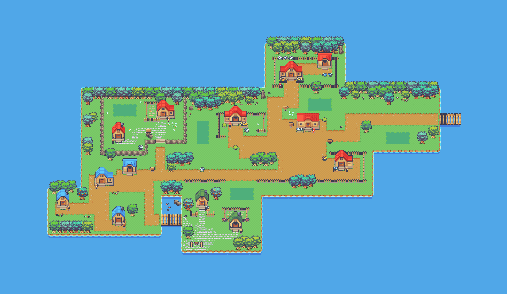
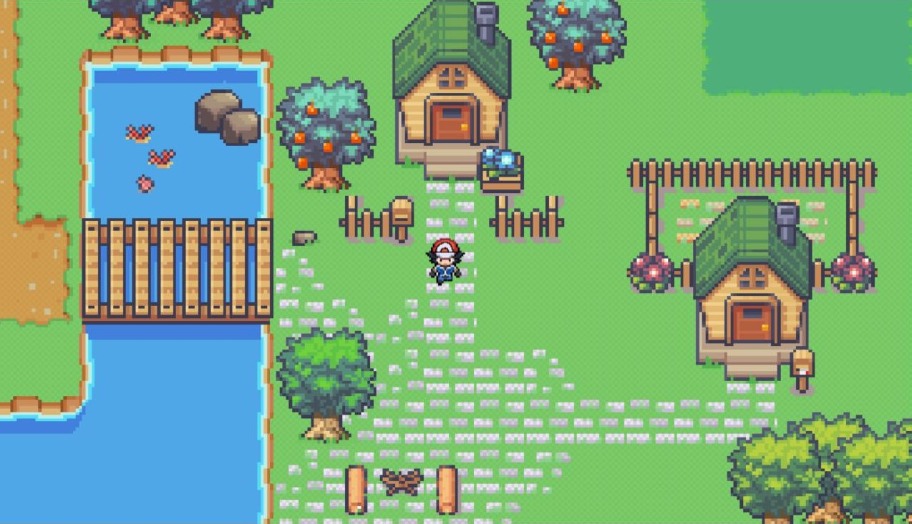

<p align="center">
  
</p>
<h1 align='center'>Pokémon Village</h1>

# About
This repository contains a game I'm currently working on. The game was inspired by the world of Pokémon and is made in Javascript using Canvas for the graphics. Currently available features only include moving around and exploring the village alongside your buddy Pikachu. The implementation of the battle system and the collection of new Pokémons is currently in progress so stay tuned.

# 📖 Storyline
As you get off the dock and start exploring the village, you notice it's empty and all the little homes have been abandonded, or so it looks like. 
An evil wizard has taken all of the pokemons into his cave up in the snowy mountains! You must fight the wizard to save the pokemons and bring them back home.

# 🗺 Map
The map was created in Tiled using game assets from itch.io. You can find the link in the "Credits" section.


# 🎮 Gameplay


# 🔧 Setup
1. Download the project or clone the repository by running the following command:
```
gh repo clone nkokor/pokemon-village
```
2. Open 'index.html'

# 💡 How to play
Use arrow keys to move around. Once you step onto a battle field (marked by a darker patch of grass), you fight the wizard. If you defeat him, you bring a pokemon back to the island. Bring all the pokemons back home to win the game.

# 🤝 Credits
Game assets used to create the map were made by LimeZu on itch.io. You can find them here: [https://itch.io/](https://limezu.itch.io/serenevillagerevamped)

Sprites used for the player were made by keith13024 on deviantart.com. You can find them here: [https://devianart.com/](https://keith13024/art/Ash-kalos-overworld-sprite-by-Keith13024-597851130)

Pokemon sprites used in the game were created by aniki0001 on deviantart.com. You can find them here: [https://devianart.com/](https://www.deviantart.com/aniki0001)

